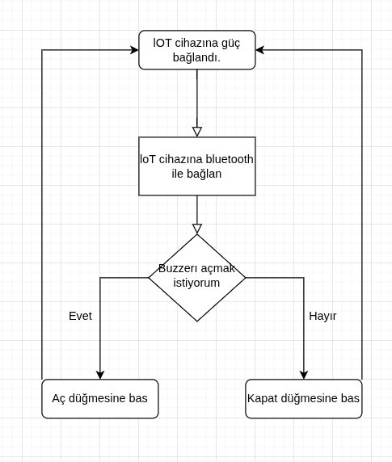
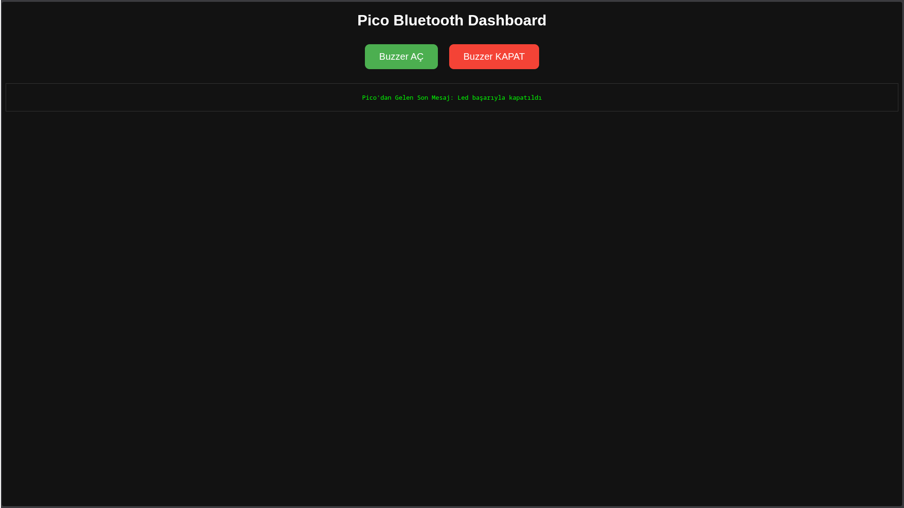

## Projenin Amacı

Bu proje, genel olarak Smart Home ve farklı IoT projelerinin çalışma mantığını anlamak ve bu alanda pratik deneyim kazanmak amacıyla geliştirilmiştir.

## Kullanılan Teknolojiler

Proje kompakt ve Ar-Ge odaklı olduğundan maliyet/performans gibi kısıtlar öncelikli değildir. Bu nedenle hızlı ve kolay prototiplemeye izin veren teknolojiler tercih edilmiştir.

- FastAPI
- Jinja2 Templates
- Rasbperry Pi Pico 
- MicroPython 
- HTML

## Uygulamaya Dair

Ekran görüntüsünde de görüldüğü üzere proje oldukça basit bir arayüze sahiptir ve yalnızca iki buton içerir.
Bu butonlardan birine basıldığında gerçekleşen işlem akışı aşağıdaki gibidir.

## Ekran Görüntüsü 

